# Chinook Album Manager User Documentation

---

## 1. Introduction

### 1.1 Purpose of the System

For this project, I built the Chinook Album Manager using PHP, MySQL and a small amount of JavaScript. The main aim was to give Chinook employees a simpler way to manage album records without editing the database manually.

The application allows the user to view albums, search for records, open full album details, create a new album with tracks, update existing records and delete albums when they are no longer needed. It also works with related data in the `artists` and `tracks` tables, so the user is not only working with the `albums` table on its own.

To show that the system works properly, I tested the full CRUD process with a sample record called `Demo Test Album`. In the screenshots below, the workflow starts from opening the system, then moves through creating the sample album, updating it, and finally deleting it again.

### 1.2 Intended Users

This guide is mainly written for:

- Chinook employees using the system
- staff members who need to search, add, update or delete album records
- users who need simple step-by-step instructions for the main tasks

### 1.3 Main Features

The finished system includes:

- a homepage dashboard showing album, artist and track totals
- a searchable album list
- a details page showing one album and all linked tracks
- a create page for inserting a new album, artist and tracks
- an update page for editing album details and track information
- a delete page with a confirmation step
- success messages after create, update and delete actions

### 1.4 System Requirements

The application is designed to run locally with:

- Windows
- XAMPP
- Apache and MySQL enabled
- phpMyAdmin
- a web browser such as Microsoft Edge or Google Chrome

### 1.5 Homepage Overview

The homepage is where the user first lands. It contains the title section, summary cards and the album table with action buttons.

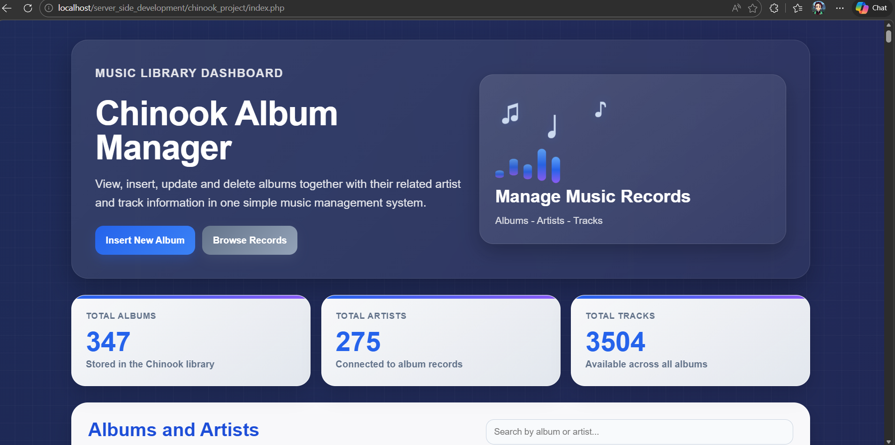
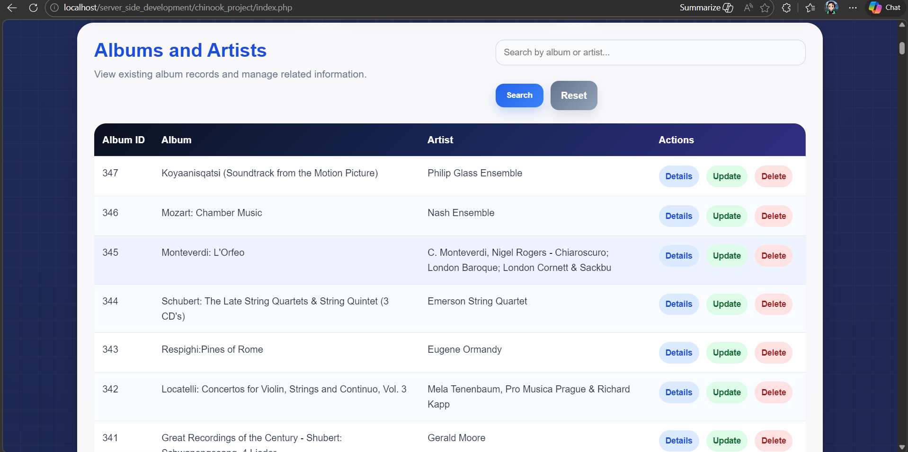
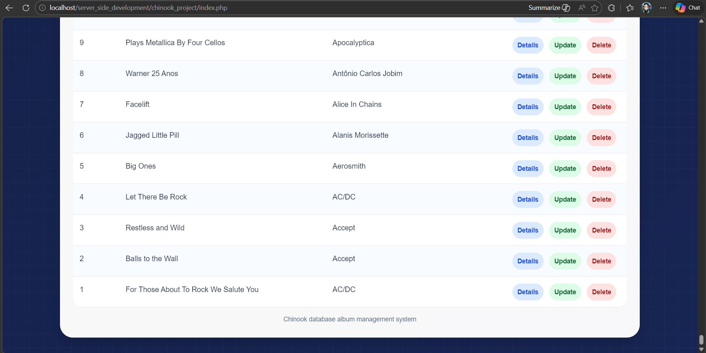

**Figure 1. Homepage of the Chinook Album Manager showing the dashboard and the main album list**

---

## 2. Getting Started

### 2.1 Starting the Local Server

Before opening the project, Apache and MySQL must be running in XAMPP.

1. Open the XAMPP Control Panel.
2. Start `Apache`.
3. Start `MySQL`.
4. Check that both services are highlighted as running.

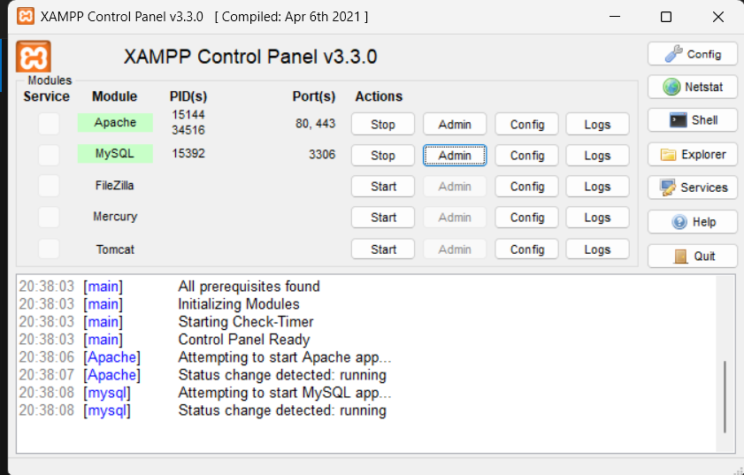

**Figure 2. XAMPP Control Panel with Apache and MySQL running**

### 2.2 Preparing the Database and Project Folder

The Chinook database must be available before the project can work. In my setup, I checked the database in phpMyAdmin and also confirmed that the project folder was available inside the local `server_side_development` directory.

The SQL file used for the database is:

`C:\xampp\htdocs\server_side_development\chinook\chinook.sql`

The application folder is:

`C:\xampp\htdocs\server_side_development\chinook_project`

The browser address for opening the system is:

`http://localhost/server_side_development/chinook_project/`

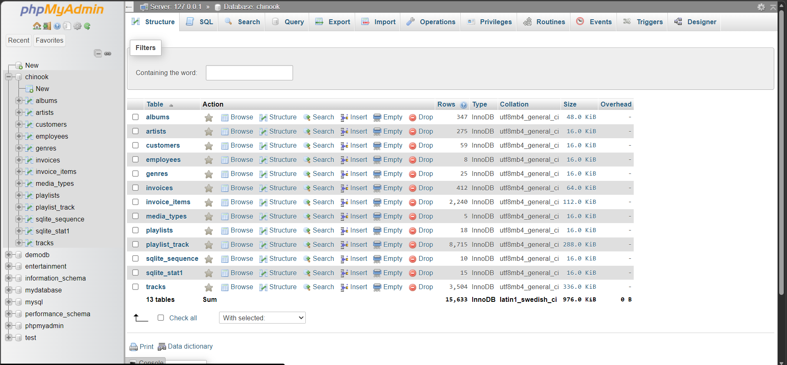
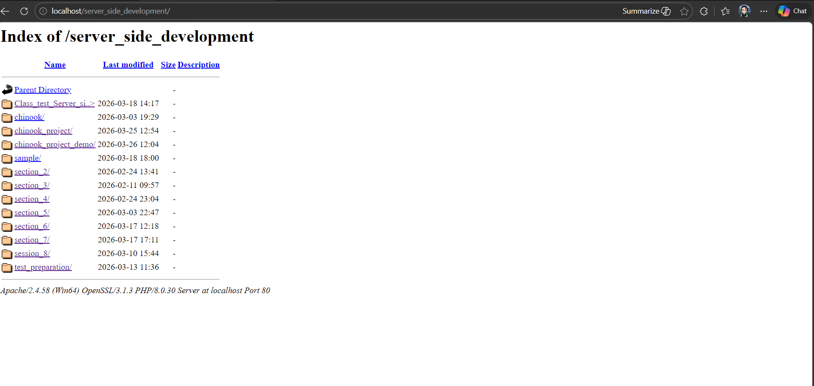

**Figure 3. Chinook database available in phpMyAdmin and the project directory visible on the local server**

### 2.3 Database Connection

The connection details used in `db.php` are:

- host: `localhost`
- username: `root`
- password: blank
- database: `chinook`

This local setup was enough to run the project successfully in XAMPP.

---

## 3. Features and Functionality

### 3.1 Search and Browse

The homepage lets the user browse album records and search by album title or artist name. This makes it much easier to find a specific record without scrolling through the full table.

In the screenshot below, the search term `monteverdi` was used and the system returned matching records.

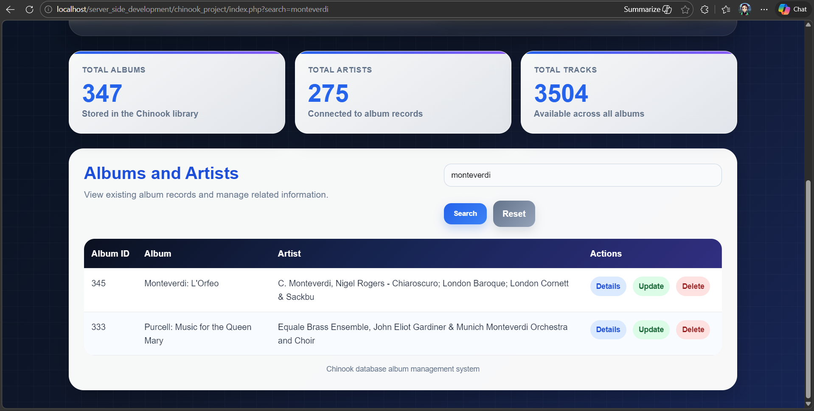

**Figure 4. Search results shown on the homepage after entering a keyword**

### 3.2 Viewing Album Details

When the user clicks `Details`, the application opens a page showing the selected album, the linked artist and all tracks stored for that album. This helps the user confirm that the correct record has been selected before making changes.

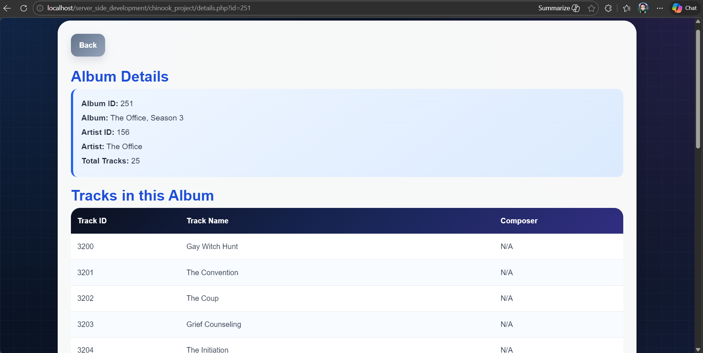

**Figure 5. Details page showing album information and linked tracks**

### 3.3 Creating a New Album

The create page allows the user to enter an album title, an artist name, and one or more tracks. This part of the project was tested by creating a sample record called `Demo Test Album`.

The first screenshot shows the blank form before any data was entered.

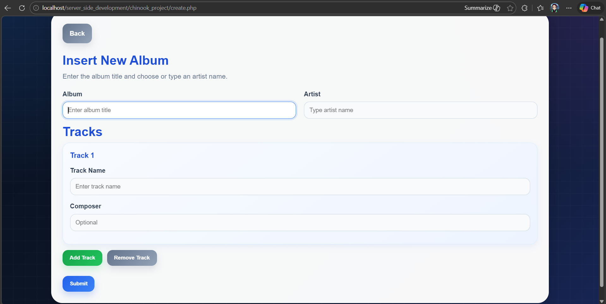

**Figure 6. Blank create form**

The next screenshot shows the same form after the test album details and two tracks were entered.

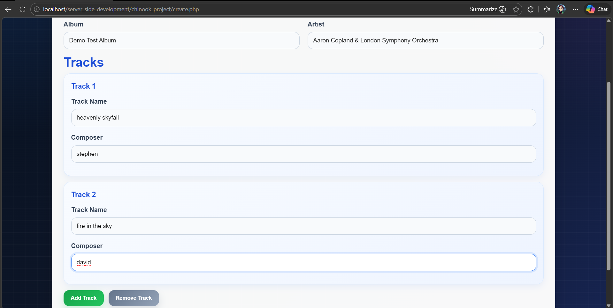

**Figure 7. Create form completed with sample album data**

After submitting the form, the homepage displayed a success message and the new album appeared in the table.

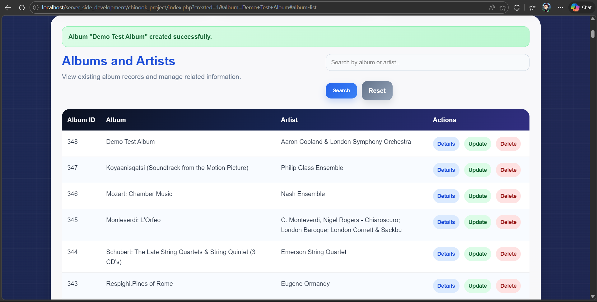

**Figure 8. Success message after creating the sample album**

I then opened the details page for the new album to confirm that the inserted tracks had been saved correctly.

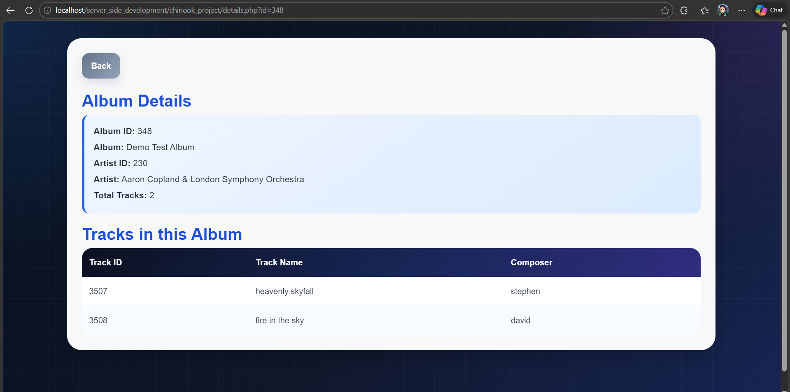

**Figure 9. Details page for the newly created sample album**

### 3.4 Updating Album and Track Information

The update page lets the user edit the album title, change the artist name, update current tracks, add new tracks and remove tracks if needed.

The screenshots below show the original update form for the sample album before changes were made.

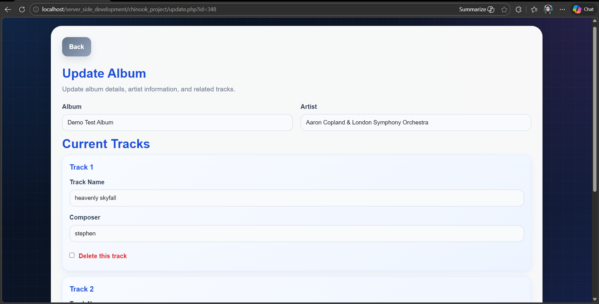
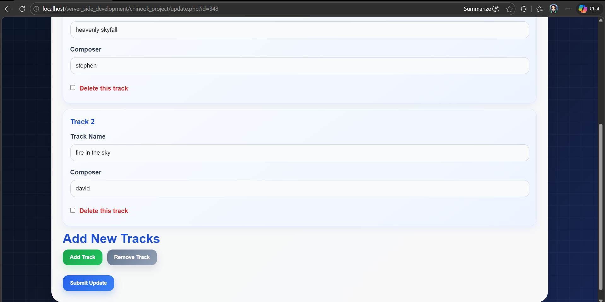

**Figure 10. Update page before any changes are submitted**

Next, I tested adding a new track. The screenshot below shows the form after an extra track was added.

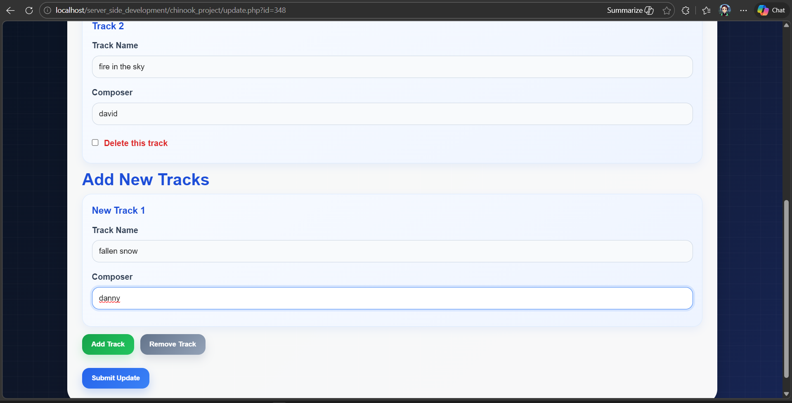

**Figure 11. Update form after adding a new track**

After the update was submitted, the details page showed the album with three tracks, confirming that the new track had been stored correctly.

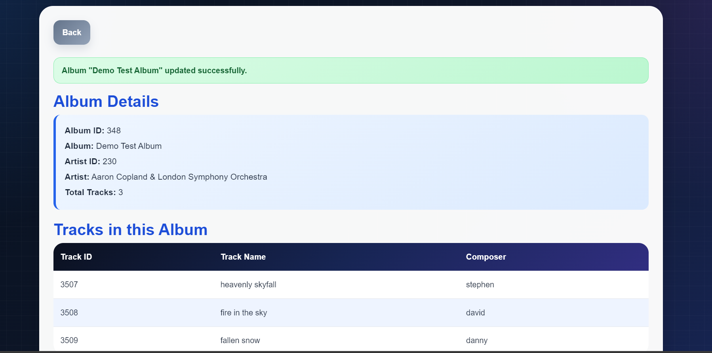

**Figure 12. Details page after adding a new track during the update**

I also tested deleting a track during the update process. In the next screenshot, one of the tracks is ticked for deletion.

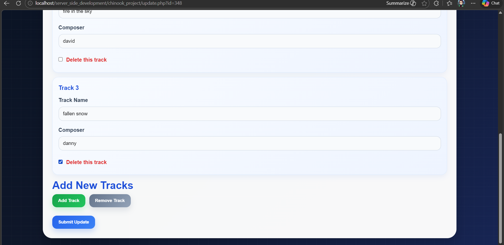

**Figure 13. Update page with one track selected for deletion**

Once the update was submitted again, the details page showed that the album now had two tracks left, confirming that the delete option inside the update form worked properly.

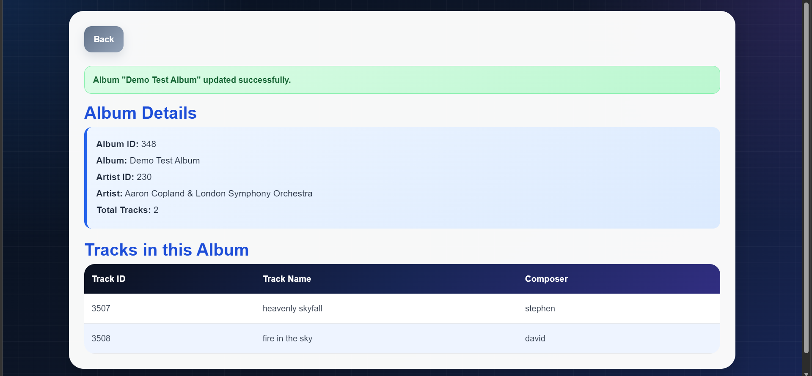

**Figure 14. Details page after removing a track through the update form**

### 3.5 Deleting an Album

The delete page asks the user to confirm the record before it is removed. It also shows which tracks will be deleted, which helps prevent mistakes.

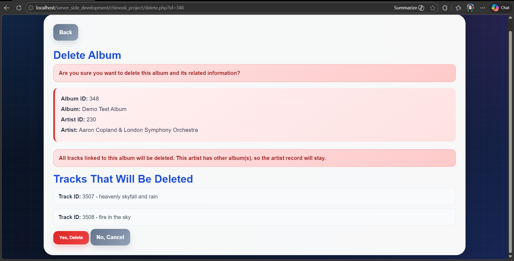

**Figure 15. Delete confirmation page for the sample album**

After confirming the deletion, the homepage showed a success message and the sample album no longer appeared in the list.

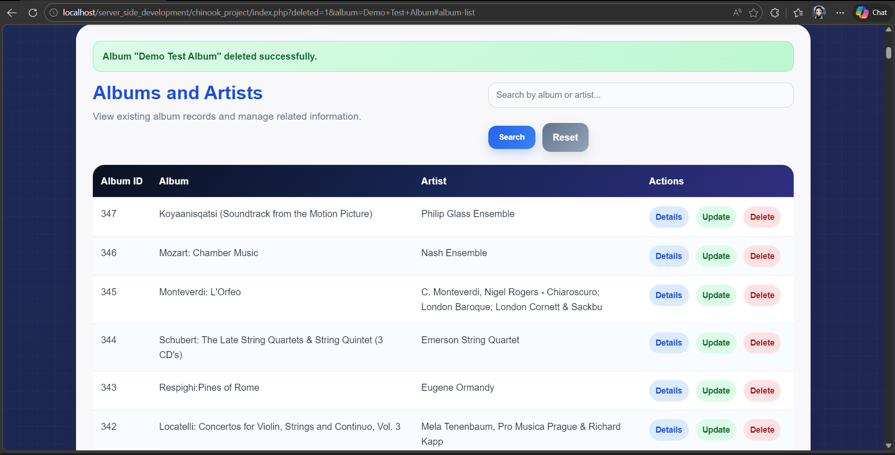

**Figure 16. Homepage after the sample album was deleted successfully**

---

## 4. Step-by-Step Instructions

### 4.1 Viewing All Records

1. Open the homepage in the browser.
2. Scroll down to the album table.
3. Review the album list and the action buttons on the right.
4. Use `Details`, `Update` or `Delete` depending on the task.

Expected result: the user can browse all available album records.

Reference: see **Figure 1**.

### 4.2 Searching for a Record

1. Open the homepage.
2. Type an album title or artist name in the search box.
3. Click `Search`.
4. Review the filtered results.
5. Click `Reset` if you want to return to the full list.

Expected result: only matching records are displayed.

Reference: see **Figure 4**.

### 4.3 Viewing Album Details

1. Open the homepage.
2. Find the album you want to inspect.
3. Click `Details`.
4. Read the album information and linked tracks.

Expected result: the details page shows the chosen album and all related tracks.

Reference: see **Figure 5**.

### 4.4 Adding a New Album

1. Open the homepage.
2. Click `Insert New Album`.
3. Enter the album title.
4. Enter the artist name.
5. Add at least one track.
6. Use `Add Track` if you want extra track fields.
7. Click `Submit`.

Expected result: the new album is added to the table and a success message appears.

Reference: see **Figures 6, 7, 8 and 9**.

### 4.5 Updating an Album

1. Open the homepage.
2. Click `Update` for the chosen album.
3. Change the album title, artist or track information as needed.
4. Add a new track if required.
5. Tick `Delete this track` if one of the existing tracks should be removed.
6. Click `Submit Update`.
7. Check the details page to confirm the change.

Expected result: the album information is updated correctly.

Reference: see **Figures 10, 11, 12, 13 and 14**.

### 4.6 Deleting an Album

1. Open the homepage.
2. Click `Delete` for the chosen album.
3. Review the album and track information carefully.
4. Click `Yes, Delete`.
5. Return to the homepage and confirm that the record has been removed.

Expected result: the album disappears from the album list and a success message is shown.

Reference: see **Figures 15 and 16**.

---

## 5. Troubleshooting

### 5.1 The Application Does Not Open

Possible causes:

- Apache is not running
- the folder is not inside `htdocs`
- the browser URL is incorrect

Solution:

- restart Apache in XAMPP
- confirm the folder path is correct
- open `http://localhost/server_side_development/chinook_project/`

### 5.2 The Database Connection Fails

Possible causes:

- MySQL is not running
- the Chinook database has not been imported
- the username, password or database name in `db.php` is wrong

Solution:

- start MySQL in XAMPP
- import `chinook.sql`
- check the settings in `db.php`

### 5.3 A Form Will Not Submit

Possible causes:

- the album title is missing
- the artist name is missing
- no track has been entered
- the same album already exists for the same artist

Solution:

- complete all required fields
- add at least one track
- change the album or artist name if the record already exists

---

## 6. Conclusion

Overall, the project meets the main aim of the brief because it supports viewing, searching, creating, updating and deleting album records while also working with the related artist and track data. The screenshots in this guide show the full workflow from setup through to testing each major function.

By creating `Demo Test Album`, updating it, and then deleting it again, I was able to demonstrate that the main CRUD features work in practice and not just in theory. This shows clearly what was completed in the final application and how the main pages behave from a user point of view.
